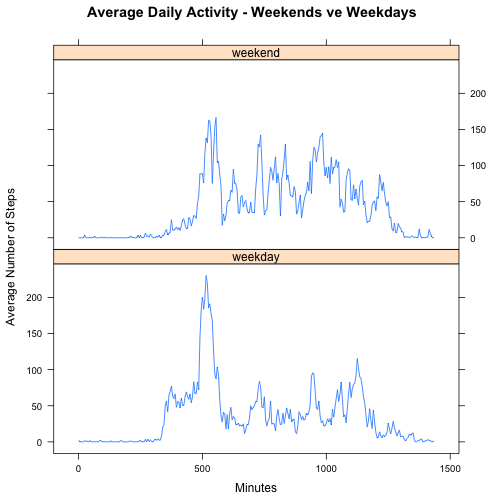

# Reproducible Research: Peer Assessment 1

## Loading and preprocessing the data

First, unzip the data file and read it into R. Add a new column which converts the interval from military time to minutes since midnight.


```r
unzip("activity.zip")
activity <- read.csv("activity.csv", colClasses = c("integer", "Date", "integer"))
activity$intervalminutes <- activity$interval %/% 100 * 60 + activity$interval %% 100
```

## What is mean total number of steps taken per day?

Calculate total steps per day, plot a histogram and report mean and median.
Note: The aggregate function ignores missing values so days in which all values are missing will not be included in this analysis.


```r
dailysteps <- aggregate(steps~date, data = activity, FUN = "sum")
hist(dailysteps$steps, main = "Histogram of Total Steps per Day", xlab = "Total Steps per Day")
```

 

Mean steps per day:

```r
mean(dailysteps$steps)
```

```
## [1] 10766
```

Median steps per day:

```r
median(dailysteps$steps)
```

```
## [1] 10765
```

## What is the average daily activity pattern?

Calculate average for each interval, plot daily activity pattern and report interval with maximum number of steps.
Note: Plot uses minutes past midnight instead of original intervals (military time) in order to prevent "jumps" at the hour boundaries.


```r
avgsteps <- aggregate(steps~intervalminutes + interval, data = activity, FUN = "mean")
plot(avgsteps$intervalminutes, avgsteps$steps, type = "l", main = "Average Daily Activity", xlab = "Minutes", 
     ylab = "Average Number of Steps")
```

 

Interval with maximum number of steps:


```r
avgsteps[which.max(avgsteps$steps),]
```

```
##     intervalminutes interval steps
## 104             515      835 206.2
```

## Imputing missing values

Number of rows with missing values:


```r
sum(!(complete.cases(activity)))
```

```
## [1] 2304
```

Impute these values by replacing them with the mean for that interval.


```r
activity2 <- activity
# Calculate interval means
imputed <- ave(activity2$steps, activity2$interval, FUN = function(x) mean(x, na.rm = T))
# Replace NA's
activity2$steps[is.na(activity2$steps)] <- as.integer(imputed[is.na(activity2$steps)])
```

Repeat the above analysis of total steps per day using the imputed data.


```r
dailysteps <- aggregate(steps~date, data = activity2, FUN = "sum")
hist(dailysteps$steps, main = "Histogram of Total Steps per Day", xlab = "Total Steps per Day")
```

 

Mean steps per day:

```r
mean(dailysteps$steps)
```

```
## [1] 10750
```

Median steps per day:

```r
median(dailysteps$steps)
```

```
## [1] 10641
```

Since there were 8 days which were not included in the initial analysis because they had no data, replacing these with average values for each interval caused a slight decrease in the  mean and median values. Summing up the average steps per interval (calculated above) gives


```r
sum(as.integer(avgsteps$steps))
```

```
## [1] 10641
```

So adding 8 of these to the original data pulls down the mean and median.

## Are there differences in activity patterns between weekdays and weekends?

Add a factor variable indicating weekend or weekday and calculate activity pattern for each factor level.


```r
weekend <- ifelse(weekdays(activity2$date) %in% c("Saturday", "Sunday"), "weekend", "weekday")
activity2$weekend <- factor(weekend)
avgsteps <- aggregate(steps~intervalminutes + interval + weekend, data = activity2, FUN = "mean")
```

Create a plot comparing activity patterns for weekdays vs. weekends (requires lattice package be installed).


```r
library("lattice")
xyplot(steps~intervalminutes | weekend, data = avgsteps, layout = c(1, 2), type = "l", xlab = "Minutes", 
       ylab = "Average Number of Steps", main = "Average Daily Activity - Weekends vs Weekdays")
```

 
